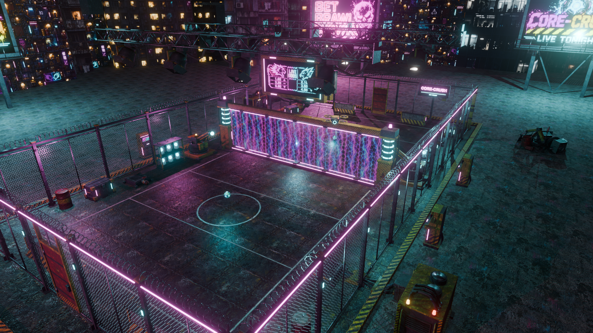
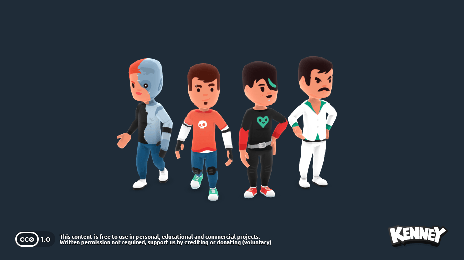

# CORE-CRUSH
ゲーム体験・対戦ルール・制作指示書
Version 2.0 / Planner's edition / 2026-10-06


# 読み方と設計の優先順位

_GUIDE_

## 8秒の危険を、相手へ叩き返す。
CORE-CRUSHは、1v1・1v2・2v2に対応するFPS/TPSドッジボール。反射だけでなく「返す・持つ・外す」の選択で相手のリズムを崩し、成功した一打そのものが気持ちよい対戦を目指す。

本書はプランナーの設計書である。体験の意図、判断に必要な仕様、受け入れ条件を中心に記載する。実装言語やツールは、体験を実現するための推奨手段として扱う。

| 表記 | 意味 |
|---|---|
| 要件 | 今回の依頼で指定された、守るべき体験・ルール |
| 初期案 | 未指定部分の補完・調整用数値。実装済みでも検証済みでもない |
| 確認済 | ローカル資料・ファイル・公式資料から今回確認できた事実 |
| 要検証 | 実機、通信対戦、人間のプレイテストで判定する項目 |

## より良い方法を採用してよい
本書の手法・ツール・配信構成・初期数値より、品質・再現性・保守性に優れた方法が見つかった場合は採用してよい。目的と受け入れ条件を保ち、比較結果と変更理由を決定記録に残す。8秒制や操作の意味など、要件そのものを変える場合は企画変更として明示する。

## 正本と既存資料
今回のユーザー指定を最優先にする。本書はD:/T3test/GDD.mdの改訂提案であり、元ファイルは保存した。開発開始時に本書から章別Markdownを作り、既存GDDを旧版と明記して現行仕様を一本化する。旧API・旧仕様の互換実装や既存データの削除は行わない。

> 品質の優先順位：入力と判定の納得感 → 球の読みやすさ → 打撃の爽快感 → キャラクター性 → 背景の豪華さ。配信先の都合で、この順序を逆転させない。


# 目次

_CONTENTS_

- p.02 読み方と設計の優先順位
- p.04 どんな気持ちよさを作るか
- p.05 世界観とコートの見せ方
- p.06 一試合の流れと勝敗
- p.07 8秒の危険時計
- p.08 球速・球威・ラリーの成長
- p.09 投げる・曲げる・惑わせる
- p.10 キャッチ・跳ね返し・ステップ
- p.11 跳ね返しの方向入力
- p.12 FPSとTPSを、視線を失わずつなぐ
- p.13 ステータスと二つの資源
- p.14 2v2と1v2を成立させる
- p.15 スキルを通常球の味方にする
- p.16 スキル案 A：球筋と時間を変える
- p.17 スキル案 B：位置と所有権を変える
- p.18 同じ身体から、違う戦い方を作る
- p.19 一打の爽快感を組み立てる
- p.20 3Dエフェクトの制作と再現性
- p.21 入力設定とHUD
- p.22 練習・部屋・試合後の体験
- p.23 既存素材の確認結果
- p.24 仮キャラクターを用意し、後で差し替える
- p.25 モーションを、ゲームの時間へ合わせる
- p.26 GPT Imageの使いどころ
- p.27 品質を底上げする基準と最適化
- p.28 WebRTC対戦で守る体験
- p.29 通信品質の受け入れ条件
- p.30 配信先は品質に合わせて選ぶ
- p.31 キャラを増やせる設計の依頼方針
- p.32 長期セッションのMarkdown設計
- p.33 hernesのコードを確認した結果
- p.34 Claude CodeとCodexでの使い分け
- p.35 工程別の具体的な依頼文 A
- p.36 工程別の具体的な依頼文 B
- p.37 開発順序と受け入れID
- p.38 調整の論点と、未検証を残す場所
- p.39 出典と確認範囲 1
- p.40 出典と確認範囲 2


# どんな気持ちよさを作るか

_EXPERIENCE_

## 「防御できた」が、そのまま強い攻撃になる
敵の速球をぎりぎりで弾く。乾いた金属音と火花が重なり、球が即座に相手へ戻る。相手も返す。速度と音の圧が上がる。そこで上カーブを混ぜると、一瞬の間が生まれる。早く手を出した敵の横を、次の球が突き抜ける。この緊張と解放が一試合に何度も訪れる。

| 行動 | プレイヤーが得るもの | 引き受ける危険 |
|---|---|---|
| 跳ね返す | 主導権、速い応酬、連続成功の快感 | 入力方向とタイミングを両立する必要 |
| キャッチする | 高いコスト獲得、フェイント・球種の選択 | ラリーが止まり、8秒を自分で管理する |
| ステップする | 最も簡単な追尾解除、立て直す時間 | 回復が遅い有限資源を消費する |
| 狙い投げする | 回避読み、コート奥への時間稼ぎ | 自動追尾がなく、相手に余裕を渡す |
| スキルを使う | 相手の立ち位置・テンポを変える | 防御で稼いだコストと注意力を使う |

## スキルが主役を奪わない
ダメージの中心は通常ボール。スキルは、受けにくい一球を作るための布石にする。初期プレイテストでは総ダメージの80%以上がボール直撃とコア爆発に由来する状態を目標にする。これは測定用の初期基準であり、比率だけで面白さを判定しない。

## 参考作品から受け取る要素
Knockout Cityから、投げるフリでキャッチを誘う読み合い。BAKUDOから、球技を激しい戦闘として見せる迫力。Slappyballから、叩き返す行為を何度も繰り返したくなる軽快さを受け取る。これは本作への企画的な解釈であり、各作品のルールをそのまま移植するものではない。[S10-S12]

> 成功の基準は「一度返せた」ではなく、「次も返したい」。10分の試遊後に、プレイヤーが気持ちよかった一打と、自分のミスの理由を具体的に説明できること。


# 世界観とコートの見せ方

_WORLD & ARENA_


## 違法サイバー・ケージファイト
違法電脳都市のジャンク街で夜な夜な開催される裏スポーツ。サイボーグや人体改造者が、廃棄予定の暴走エナジーコアを投げ合う。賭け率のホログラム、濡れた金属床、金網の外の観客が、危険な見世物の空気を作る。賭博は世界観上の演出で、実際の賭け機能は設計対象外。

## フェンスには二つの役割がある
中央のプラズマ・フェンスは生体を阻み、コアを通す。コアの通過は危険時間のリセットを意味する。通常時は相手の全身と球が読み取れる透明度を保ち、通過時だけ局所的に波紋を出す。中央全面を白く光らせない。

## 既存素材を生かす
図はD:/T3test/arena/_preview/stage_wide.pngにある既存プレビュー。夜景と濡れた床の方向性は採用するが、対戦時の明るさ・フェンスの透過・コアの見やすさは別途調整する。画像はゲームの実行画面や性能検証結果ではない。

既存ステージの制作スクリプトは片側10m×12mを想定している。初期プレイエリアはこれを使い、装飾のある外周と衝突境界を分ける。画面内の看板や雨が、球の輪郭や球種の手掛かりを隠すなら背景側を調整する。[L1]


# 一試合の流れと勝敗

_MATCH RULES_

## 対戦形式を最初から三つ用意する
1v1は純粋な読み合い、2v2はターゲット変更と味方によるカバー、1v2は少人数でも成立する非対称戦。どの形式でも生きたボールは一つ。幻影や背景のコアは数えない。

| 項目 | 初期案 |
|---|---|
| 勝敗 | 相手チームの全員をHP 0にすればラウンド勝利。2ラウンド先取 |
| KO | そのラウンドは復活しない。接触判定を外し、味方観戦へ移る |
| ラウンド時間 | 180秒。時間切れは各チームの残存HP合計÷開始時最大HP合計で比較 |
| 同率・同時全滅 | 引き分け。ラウンド得点を与えず再試合 |
| 初期資源 | HP全快、コスト1、ステップ2。開幕フェイント・召喚を体験可能 |
| 最初の球 | 初回は抽選、以後は前ラウンドと逆のチーム側に供給 |
| 開始手順 | 全員ロード完了 → 3秒カウント → 球を出現 → 1秒後に操作と危険時計を同時開始 |
| チーム | 試合中の人数・所属変更は不可。切断時は通信章の扱い |

## 球を拾う・落とす
停止・低速の未所持球へ1.2m以内に近づくと自動回収する初期案。球召喚は同じ状態の球を遠くから取る手段。投げられてまだ攻撃判定を持つ球は、近づくだけでは回収できない。

被弾した球は攻撃判定を失い、被弾地点付近へ落ちる。危険時間は継続する。1球で味方まで貫通して複数人に直撃しない。KO者が持つ球もその位置へ落ちる。球を手放す専用パスは初期版には設けない。

> 勝敗判定は、同じ時刻の直撃・爆発・KOをまとめて処理した後に一度だけ確定する。通信相手によって勝者が違う状態は不合格。


# 8秒の危険時計

_CORE TIMER_

> 中央通過 → 0〜3秒：スマイル → 3〜5秒：焦り → 5〜8秒：激怒 → 8秒：爆発。次の中央通過で受け側を0秒へ。
## 中央を越えた瞬間から、受け側の8秒
要件：投げられた球の中心が中央平面を越えて相手エリアへ入った時刻を0秒とする。手に持つ、キャッチする、地面に落ちる、リングで止まる、拾う、同じ陣内を移動する行為では時計を戻さない。新たに中央を越えたときだけ受け側の時計を0秒にする。

「投げたから間に合った」ではない。自陣を出る前に8.000秒へ達したら爆発する。7.8秒でリリースしても、中央通過が8.1秒なら自陣で失敗。ちょうど8.000秒と通過が重なる場合は爆発を優先する初期案。

| 状態 | 時計と結果 |
|---|---|
| 通常の侵入 | 0秒から開始。保持中・飛行中・接地後も進む |
| 初球・爆発後の新球 | 通過していない例外。出現演出1秒後、置かれた側の時計を開始 |
| 自陣内の球召喚 | 時計を保持。危険度を消す抜け道にしない |
| 8秒経過 | 当該陣の生存者全員に30ダメージ。位置やステップでは防げない |
| 爆発後 | 旧球を消し、反対側の供給位置へ1秒後に新球を出す |

## 顔・音・数字を同じ状態に結びつける
0〜3秒未満は通常スマイル、3〜5秒未満は焦り顔、5〜8秒未満は赤い激怒顔。7秒以降は短い警告音と顔の亀裂を追加する初期案。HUDは「残り秒」、表情のルールは「経過秒」と表記して混同しない。

> 被弾と爆発が近接すれば両方のダメージを受けうる。これは危険を抱え続けた結果として扱う。爆発した球から追加の直撃を発生させない。


# 球速・球威・ラリーの成長

_BALL ECONOMY_

## 危険を抱えるほど、次の一球が強くなる
以下は全て初期調整案。攻撃5・経過0秒の基本速度はストレート28m/s、左右カーブ23m/s、上カーブ17m/s。直撃の基本ダメージは20。狙い投げはストレートと同じ速度・ダメージだが追尾しない。

| 自陣の経過時間 | 0秒 | 4秒 | 6秒 | 7.5秒 |
|---|---|---|---|---|
| 次の投球の速度倍率 | 1.00 | 1.06 | 1.14 | 1.22 |
| 次の投球の威力倍率 | 1.00 | 1.15 | 1.34 | 1.53 |

速度倍率は1＋0.25×(経過秒÷8)²、威力倍率は1＋0.60×(経過秒÷8)²。リリース時または跳ね返し接触時の値を記録する。中央を越えて顔が落ち着いても、すでに投げた球の速度と威力は弱くならない。

## 跳ね返しは「倍率を掛け続ける」のではなく段階を積む
跳ね返し成功ごとに速度・威力のラリー加算値を足す。so-soは速度+3%／威力+5%、goodは+5%／+8%、justは+7%／+12%。ラリー分の上限は速度+40%／威力+80%。返球時には返す人の攻撃値と選んだ球種で速度を計算し直す。

キャッチ、被弾、球が攻撃判定を失う、爆発でラリー段階を0にする。中央通過だけでは段階を消さない。経過時間による倍率は各返球で更新し、過去の危険倍率まで重ねない。次球バフは当該球の最初の飛行だけに適用する初期案。

## 反応不能を上限にしない
総速度は当該球種の基本速度×1.60、総威力は基本ダメージ×2.50を仮上限とする。さらに、発射・返球から対象への最短到達が240msを下回る場合は速度を抑える。距離を詰める強さを残しつつ、ゼロ距離の確定攻撃を防ぐ。上限で補正が頭打ちになることは調整画面で確認できるようにする。

上限、距離、カーブの軌道長を含めて「ストレートが最速、上カーブが最遅」を検証する。飛翔時間の下限は未検証の企画案であり、爽快感を保てる別手法があれば比較して変更できる。


# 投げる・曲げる・惑わせる

_OFFENSE_

| 攻撃 | 体験と使いどころ |
|---|---|
| ストレート | 相手へ最短で迫る基本球。フェイント後の硬直を取る主役 |
| 左右カーブ | 地面と水平な弧。横ステップを追い、前後ステップで追尾解除 |
| 上カーブ | 上へ弧を描き斜めに落ちる最も遅い球。ラリーの拍をずらす |
| 狙い投げ | ADS中、レティクル方向へ追尾なしで投げる。移動読み・奥への時間稼ぎ |
| 投げるフリ | コスト0.25で本物と同じ投げ始め。球は離れず、任意行動へキャンセル可能 |
| スキル | 保持の有無にかかわらず使用可。通常球が通る状況を作る |

## 投擲の時間と移動
初期案：クリックから球が離れるまで8F＝約133ms、離れた後の硬直8F。投げ始めの8Fだけ歩行速度を通常の30%にする。長押しで無限に溜める方式ではない。球種と狙いはリリース時に確定し、それまでの方向入力を反映する。

フリは開始時にコストを消費し、キャンセルしても返還しない。フリから本投げへ移る際は、投擲の8Fを最初から実行する。フリの途中まで進んだ腕を使って発生を短縮しない。既に押している移動キーでは即キャンセルせず、フリ開始後の新たな行動入力・移動方向変更でキャンセルする。

## 追尾球を通常移動で避けさせない
ストレート・左右・上カーブはロック対象へ追尾する。通常歩行だけで外れる、床に刺さる、装飾へ引っかかる挙動は不合格。自動追尾中は対象の有効防御、スキル回避、被弾、または8秒爆発で解決する。

狙い投げ・追尾解除後の球は床や外周への最初の衝突で攻撃判定を失い、回収可能になる初期案。追尾解除しても当たり判定自体は消えないため、進路へ戻れば被弾しうる。地面に落ちても8秒は進む。

> 上カーブの有効ステップ方向は原案では未指定。本書では「全方向で追尾解除」を初期案にする。上下カーブの読み合いが弱い場合だけ、左右限定案と比較する。


# キャッチ・跳ね返し・ステップ

_DEFENSE_

## 同じ受付幅、違う報酬
要件：キャッチと跳ね返しの成功猶予は同じ。防御値に応じて両方の受付幅を増減させる初期案とする。判定は60Hz換算で記述し、描画が144fpsでも受付時間を変えない。ボタン押しっぱなしで再発動しない。

| 行動 | 初期タイミング | 成功報酬・次の展開 |
|---|---|---|
| キャッチ | 発生1F、受付W、全体24F。空振りは全体54F | so-so +0.25、good +0.5、just +1.0。justは最大HPの3%回復 |
| 跳ね返し | 発生1F、受付W。接触時に即返球、その後6F硬直。空振り全体30F | 全評価でコスト+0.25。評価でラリーの成長幅が変わる |
| ステップ | 消費1。移動距離2.8m／12F、全体18F | 有効方向で追尾解除。コスト獲得なし。無敵時間なし |

## 評価を一つの軸で伝える
防御5のWは9F。受付開始から最初の2Fで接触＝just、次の3F＝good、残り＝so-so。遅く押すほど危険だが高報酬。防御値が変わってもjustの2Fは増やさず、末尾のso-soを増減する初期案。判定結果は小さな文字・音色・衝撃輪で伝え、球を覆わない。

キャッチ成功中は球を保持するが、全体動作が終わるまで投げられずFPSにも移らない。キャッチ中にも危険時計が満了すれば爆発する。just回復は最大HPを超えない。コスト報酬は一球につき成功した一人へ一度だけ与える。

## 空振りしたら、資源を使って逃げる
キャッチ空振りの受付終了後は、再キャッチ・跳ね返しへすぐ移れない。ステップと即時移動系スキルでは残り硬直をキャンセルできる初期案とし、フリに釣られた罰を資源消費として残す。球召喚・通常投擲では空振り硬直を消せない。

初期の有効ステップ方向はストレート全方向／左右カーブ前後／上カーブ全方向。方向は球を受ける本人のコート前後軸を基準にし、カメラを横に向けても相性を変えない。


# 跳ね返しの方向入力

_PARRY INPUT_

## 「受ける向き」と「返す球種」は別の操作
マウスは来た球を受ける向き、移動キーは返す球種を決める。例えば、右から来た球にマウスを右へ振りつつS＋左クリックすると、右側で受けて上カーブを返す。

| 受ける方向 | 防御入力 |
|---|---|
| 右から来るカーブ | 左クリック＋マウスを右へ振る |
| 左から来るカーブ | 左クリック＋マウスを左へ振る |
| 正面のストレート | マウスを大きく動かさず左クリック |
| 上カーブ | マウスを手前へ引きながら左クリック |

狙い投げは自動追尾しないが、当たる球にはキャッチ・跳ね返しができる。狙い投げの受け方向は受け手から見た入射方向で決め、前方の直球ならニュートラル。真後ろからの球を視認なしで受ける仕様にはしない。防御範囲は正面160度を初期案とする。

## 振ってからクリックも、クリックしてから振るのも認める
初期案：クリック前80msから、クリック後50msまたは球接触の早い方までのマウス移動を集める。接触より後の操作で成功へ書き換えない。左右は水平成分、上カーブは手前方向の縦成分を評価し、逆方向・斜めの迷い入力は失敗理由を練習モードで可視化する。

クリック時点から防御受付終了まで、カメラの回転感度のみ通常の25%にする。判定用マウス量はこの減衰前に取る。終わったら通常感度に戻し、試合終了・被弾・ポーズでも減衰が残らないこと。Y反転はカメラの設定であり、「手前へ引く」というジェスチャーの意味は変えない。

## 機器差で難易度を変えない
マウスDPIと感度の違いを吸収する校正画面を設ける。方向閾値はクリック精度と同様に検証対象。初期の目安は減衰前の視角換算2度以上で方向入力、2度未満はニュートラル。方向入力の主成分が同値なら、直近の移動成分を優先する。閾値の境界も校正画面で試せるようにする。

返球先は接触時のロック対象、返す球種は同時刻の方向入力で確定する。Qによる変更を接触まで受け付け、返球済みの球をQで飛行途中に曲げ直さない。


# FPSとTPSを、視線を失わずつなぐ

_CAMERA_

> 非所持TPS → キャッチ全体（球保持・TPS） → 終了後FPS → 投擲後TPS。跳ね返しはTPSのまま。
## レティクルは常に中央に置く
所持中はFPS、非所持中はTPS。キャッチ成功時は全体動作終了後にFPSへ移る。跳ね返しは所持状態を経由せず、TPSのまま返す。ラリーの一打ごとにカメラを前後へ動かさない。

| 場面 | 見せ方の初期案 |
|---|---|
| キャッチ全体終了 | 100msでFPSへ移行。向きと狙っている点を維持 |
| 投球リリース | 後硬直終了から100msでTPSへ。次の受球を隠さない |
| ADS | FPSから少しズーム。FOV 90→75度を仮基準にする |
| 跳ね返し | 前後切替なし。衝撃の揺れのみ80〜120ms |
| 被弾・強制落球 | 視線の向きを維持してTPSへ。強制的に敵を振り向かない |

移行演出が終わるまで次の操作を待たせない。攻撃受付は行動の硬直で決まり、カメラ補間はそれと独立する。FPSとTPSの肩位置の差は同じ照準点へ向けて吸収する。ADSの射線はカメラではなく実際の球の発射位置から判定し、壁越し撃ちを防ぐ。

## 揺れるのは画面の演出、狙いは揺らさない
シェイクや色収差は表示側だけに加え、狙い投げの照準・マウス方向判定・通信上の向きを変えない。大きいFOVパンチ、ロール、ターゲットへの自動旋回はラリー中に使わない。

TPSの肩越し位置、FPSの腕・球の大きさは、近距離の球が隠れない範囲に調整する。壁際ではカメラが金網の裏へ抜けないよう距離を詰めるが、プレイヤー本体の位置は動かさない。画面揺れ0でも成功が音と輪郭で分かることを必須とする。


# ステータスと二つの資源

_STATS & RESOURCES_

## 数字の役割を混ぜない
HPは生存力、コストはスキルとフリの燃料、ステップコストは回避回数。攻撃は通常球の速度、防御は最大HPと防御受付、敏捷は歩行とステップ回復へ作用する。防御によるダメージ軽減をさらに重ねない。

| 値 | 1 | 3 | 5 | 7 | 10 |
|---|---|---|---|---|---|
| 攻撃：球速倍率 | 0.88 | 0.94 | 1.00 | 1.06 | 1.15 |
| 防御：最大HP | 76 | 88 | 100 | 112 | 130 |
| 防御：共通受付W | 7F | 8F | 9F | 10F | 11F |
| 敏捷：歩行倍率 | 0.88 | 0.94 | 1.00 | 1.06 | 1.15 |
| 敏捷：1ステップ回復 | 19秒 | 17秒 | 15秒 | 13秒 | 10秒 |

初期式：速度・移動は1＋0.03×(値−5)、最大HPは100＋6×(防御−5)、回復秒は20−敏捷。Wは防御1〜2が7F、3〜4が8F、5〜6が9F、7〜8が10F、9〜10が11F。基準歩行速度は5m/s。ステップ距離は全員共通として回避相性を保つ。

## コスト：最大5、自然回復なし
原案の「キャッチで0.5」はgood時の標準報酬として整理する。so-so 0.25／good 0.5／just 1.0、跳ね返しは全評価0.25、回避は0。上限超過分は切り捨てる。フリは0.25、球召喚は1。各キャラの2枠はアクティブ／パッシブを自由に組み合わせられる。

## ステップ：最大2、相手陣に球がある間だけ回復
欠けた1ポイントずつ順に回復する。敏捷5なら15秒で1ポイント。途中の進捗は球が自陣に戻ると停止し、次に相手陣へ渡ると再開。満タン時は余剰時間を貯蓄しない。球が存在しない爆発後の間・開始演出・中断中も回復しない。

相手が持つ・落としている・リングに止まっている時間も相手陣滞在として数える。球は1回8秒未満で返るため、敏捷5の15秒は複数の往復で蓄積する。「遠くに狙い投げして稼ぐ」と「即返球して回復させない」が同じ時計で成立する。


# 2v2と1v2を成立させる

_TEAM PLAY_

## 一球だから、狙いの変更が大きな出来事になる
2v2ではQで生存する敵を順に切り替える。ロックは画面の中心に近い敵を初期対象とし、選んだ相手を明瞭な枠で表示する。攻撃者が背を向けても球が読めない位置から勝手に発射されないよう、投球時は対象が正面160度内にいることを初期条件とする。

追尾先は球が離れた瞬間に固定。跳ね返し直前ならQで別の敵を選べる。敵のKO時は生存者へ選択を更新するが、飛行中の球が対象を失った場合は追尾を切り未所持球へ向かう処理にする。突然別の味方へ再追尾して理不尽な被弾を作らない。

## 味方を助ける防御
非対象の味方も球へ近づき、同じ方向・時間判定でキャッチや跳ね返しができる。味方の体を盾にするだけでは吸わない。直撃判定はロック対象のみ、狙い投げは最初に当たる敵1人とする初期案。敵の非対象者による能動防御が先に成功すればその結果を採用する。

同時防御は、接触時刻が早いものを採用。同じ判定時刻なら球と防御点の距離、さらに同値なら固定の参加者IDで一意に決める。敗れた側へ成功報酬を付けない。フレンドリーファイアと味方同士の押し合いは無効。

## 1v2：人数を変えられることと、公平であることを分ける
初期はカスタム対戦として用意する。単独側の最大HPを1.6倍、爆発ダメージを人数にかかわらず1人30とし、コスト・ステップ上限・防御受付は変えない。単独側が倒す必要のある総HPと、二人側の同時妨害に対する最低限の補正である。これは対等な勝率を保証する値ではない。

1v2では2人側の強い拘束スキルに共有再発動間隔を設ける（次ページ）。初期案は互角の熟練度で単独側勝率40〜60%を目標に、対戦組を入れ替えた30試合以上で評価する。2v2の片方がKOして生じた1v2では、途中からHP補正を付けない。


# スキルを通常球の味方にする

_SKILL PRINCIPLES_

## 全員共通：球召喚
要件：コスト1。自陣内の「投げられていない球」を即座に手元へ呼ぶ。初期案では未所持かつ攻撃判定のない球に限定し、味方が持つ球やまだ飛行中の敵球は奪わない。条件不成立時はコストを消費しない。危険時計はそのまま。既定キーはCとする。

## 固有2枠：AA、AP、PPすべて可能
パッシブ枠には常時効果の説明を出し、E/Rを押させない。アクティブは保持中・非保持中のどちらでも発動できる。次球バフは非保持時に予約できるが、消費は次の手投げ時。アクティブ間の同時発動、投球中発動の扱いをキャラごとに変えず、共通行動ルールに従わせる。

| 共通制約の初期案 | 意図 |
|---|---|
| 直接攻撃スキルは追尾なし | 自動的にステップを吐かせる手段を増やさない |
| 直接スキルのHPダメージは0 | 役割は拘束・落球・位置変化。HP削りは通常球 |
| 強い妨害は予兆300ms以上 | 通常移動でも対応可能な余地を作る |
| スタンは最大0.35秒 | 長い操作不能からの確定球を防ぐ |
| 拘束終了後1.5秒の拘束耐性 | スタン・引き寄せの連鎖を防止。ボールは防げない |
| 1v2の2人側は拘束成功後3秒共有待機 | 二人の交互拘束による単独側の封殺を防ぐ |

## 発動操作は既存の入力を壊さない
即時型はE/Rで発動、設置型はE/Rを押してプレビュー、離して確定。設置中の左クリックは通常の投球／跳ね返しを優先して設置を取り消す。防御を奪う設置UIにしない。設置可能な地面と届く範囲だけを表示し、確定時にコストを消費する。

> 球が来ていない側のプレイヤーも、スキルだけで相手の操作を奪い続けられてはいけない。個別スキルの強さだけでなく、2人が同時に使う場面を必ず試す。


# スキル案 A：球筋と時間を変える

_SKILL CATALOG / A_

## 01 オーバーチャージ
アクティブ／コスト1.5／CT8秒。次の手投げ1球に速度+10%、威力+25%を付ける初期案。使用時に腕と球が発光し、相手にも予約が分かる。8秒で予約失効、重ねがけ不可。跳ね返された時点で固有バフは消え、ラリー成長だけが残る。球速上限は越えない。

## 02 スクラップ・トラップ
アクティブ／コスト2／CT10秒。相手陣に1個、予兆0.5秒後から8秒有効。踏んだ敵を0.3秒スタンさせる初期案。暗い背景でも輪郭と床の警告模様が見える。通常歩行で避けられる大きさ・起動時間にする。コート全幅や供給球の出現位置を封鎖しない。

## 03 ブーストリング
アクティブ／コスト2／CT12秒。相手陣の指定位置に1個、10秒残る初期案。配置後はQの選択巡回にリングを追加し、「リング経由・最終対象P2」とHUDで区別する。リングを選んだ投球はそこへ向かい、到達後0.15秒静止、指定敵へ再射出される。

リングの再射出は中速の追尾ストレートを初期案とし、新しい防御入力の対象にする。危険時計は止めず、再射出でもリセットしない。再射出後の最短到達240msを守る。敵の体へ重ねて置けず、中央を跨ぐ転送でもない。対象がKOしたら球をその場へ落とす。リング同士の無限経由は禁止。

## 04 ファントム・スロー
アクティブ／コスト2.5／CT12秒。次の手投げが、ストレート・左右・上カーブの4球に見える。本物は選んだ1球で、他の3球はリリース0.3秒後に消える。幻影はダメージ・防御報酬・衝突判定を持たない。

初期案では本物を含む最短着弾を480msに制限し、幻影消滅後に180msの判別時間を残す。近距離でも消える前に当たる完全な運任せを避けるための代償。通常投球より遅くなることもある。最適な対抗策が「常にキャッチ」へ固定されないか重点検証する。


# スキル案 B：位置と所有権を変える

_SKILL CATALOG / B_

## 05 バックライン封鎖
アクティブ／コスト3／CT15秒。相手陣の後ろ半分を4秒間侵入不能にする初期案。予兆0.6秒中は逃げられる。後方に残った敵はダメージなしで前半の最も近い合法地点へ短時間で押し出す。その移動中も防御入力を受け付け、カメラを振り回さない。球は通過可。重複配置で残り半分をさらに削れない。

## 06 チェーンハンド
アクティブ／コスト2／CT10秒。レティクル方向へ非追尾の鎖を飛ばし、命中者を相手陣の前面へ引く。初期案は予備動作0.3秒、鎖の移動速度18m/s、引き寄せ0.25秒。中央や壁を越えず、自分側には連れてこない。引かれている最中もキャッチ・跳ね返しが可能。直接HPを削らない。

## 07 エナジーボルト
アクティブ／コスト2／CT10秒。狙い投げと同じ照準方法の非追尾エネルギー弾。所持中の敵に当たれば強制落球し、球を攻撃者側へ移す。非所持なら0.35秒スタン。移動で避けられる発生・速度・幅にする。

所有権移動の初期案：落球した球から攻撃判定を外し、0.35秒の見える転送軌道で中央を通って攻撃者陣の供給位置へ送る。通常の中央通過で時計をリセットし、その位置から回収する。転送中も元陣の時計は進み、通過前に8秒なら爆発して転送失敗。瞬間的なタイマー消去や無償の手元回収にしない。

## 08 ブリンク
アクティブ／コスト1.5／CT9秒。キャラの向きに水平4m瞬間移動する初期案。保持中も使用でき、非保持時は自分を追う球の追尾を切る。無敵は付けない。上を向いても飛行せず、相手陣・外壁・封鎖エリアを越えない。到着予定地点を本人へ表示し、不成立なら消費しない。

## 共通の相性整理
球のキャッチ・跳ね返しで鎖やエネルギー弾は防げない初期案。その代わり非追尾・予兆・拘束耐性によって歩行回避を成立させる。スキルの演出には通常球と異なる輪郭と音を使い、ボールだと思ってキャッチしたという誤認を減らす。


# 同じ身体から、違う戦い方を作る

_CHARACTERS_

## 初期ロスター案
全員が共通モデル・骨格・投球・防御モーションを使う。見た目の差は基本色、発光色、番号、キャラ名とスキルアイコン。チーム色とキャラ固有色は別管理とし、敵味方を色だけで区別させない。

| 仮称 | 攻撃 / 防御 / 敏捷 | 固有2枠 | 遊びの狙い |
|---|---|---|---|
| VOLT | 7 / 4 / 4 | オーバーチャージ、ブリンク | 前へ踏み込む、速さで圧をかける |
| ECHO | 4 / 6 / 5 | ファントム、ブーストリング | 一拍ずらす、角度で迷わせる |
| ANCHOR | 4 / 7 / 4 | チェーン、パッシブ「蓄勢」 | 受けて貯め、近くへ引き出す |
| SWITCH | 5 / 4 / 6 | トラップ、エナジーボルト | 歩く場所を変え、球を奪う |

初期のステータス合計は15で揃えるが、合計が同じなら強さも同じとは考えない。防御にはHPと受付の二重の価値があるため、実戦結果と「ミスしても許される回数」を見て調整する。

## パッシブの試験枠
蓄勢はgoodキャッチのコスト獲得を0.5→0.75にする初期案。justはすでに1.0のため増やさない。もう一つの試験用パッシブ「省エネ」は球召喚コストを1→0.75にする。PP構成はこの二つを使った検証用キャラで成立を確認し、正式採用は実戦評価後とする。

## 色替えだけでも対戦中に読める
キャラごとの予兆音、スキルアイコン、名札を統一規則で作る。相手の構成はラウンド開始前に表示する。キャラ固有色で通常球の球種表現を上書きしない。同キャラ対戦でもロック対象とチームが即座に分かること。

> バックライン封鎖は初期の正式ロスターには入れず、全スキル検証用の選択枠で試す。削除ではなく、体験を壊しやすい高影響スキルとして別評価する。


# 一打の爽快感を組み立てる

_GAME FEEL_

> 接触0ms：音・火花 → 20〜35ms：腕の局所強調 → 80〜120ms：揺れ収束 → 240ms以降：次の最短接触。
## 強さを、短い時間に集中させる
跳ね返しの瞬間に、手元の金属的な打撃音、短い低音、球から外へ散る火花、薄い衝撃輪を重ねる。視線の中央は空け、80〜120msでシェイクを収束させる。次の着弾まで視界が落ち着くことが、連続で気持ちよく返す前提になる。

| 結果 | 音 | 画面・球の変化 |
|---|---|---|
| so-so | 少し鈍い接触音 | 小さな火花、短い軌跡 |
| good | 明瞭な金属音＋軽い低音 | 細い衝撃輪、球の発光を一段上げる |
| just | 鋭い芯＋厚い低音＋短い高音 | 白い芯と外周火花、最も短く強い強調 |
| 被弾 | 成功音と異なる重い破砕音 | 画面外周へ衝撃、球の位置は見える |
| 爆発 | 顔のノイズ→破裂→低音 | 局所閃光、破片、陣全体の一回だけの揺れ |

## ラリーは音で温度が上がる
ラリー段階で金属音の高さ・軌跡・発光を少しずつ変える。単に音量を上げ続けず、上限で飽和させる。背景音楽・観客・雨音は重要な投球予兆や着弾音が鳴る間だけ控える。敵味方の成功音は位置と音色で区別する。

## ヒットストップは通信の時計を止めない
初期案は自分の腕・局所エフェクトの見せ方だけを20〜35ms強調する。ボール移動、8秒時計、入力受付、相手の画面は止めない。全世界停止を入れる場合はオンラインで同じルールを保てることが前提で、無検証では採用しない。

色収差は画面外周へ短く、レティクルと球の中心には掛けない。揺れ・閃光・色収差・モーションブラーは個別に弱められる。演出を切った人だけ防御が有利になるほど、標準演出が情報を隠す状態を作らない。


# 3Dエフェクトの制作と再現性

_VFX PIPELINE_

## 推奨：コアの表情とフェンスは専用、瞬間演出はEffekseerを比較
常時表示するコアの顔・フェンス・軌跡は、素材と表示パラメータを直接制御する。火花、衝撃波、爆発、鎖、リング起動はEffekseerを候補とする。公式EffekseerForWebにはWebGL／WebGPUのランタイムとThree.js向け例がある。採用時の版を固定し、本作の描画構成で深度・透過・色が一致するか先に実験する。[S7]

## 一本の再現できる制作手順
1. 企画カードに「何を伝えるか、発生位置、予兆、ピーク、終了、最大同時数」を書く。
2. 静かな背景と既存ステージの両方で、単体エフェクトを作る。
3. 球・手・床などの取り付け位置を共通名で合わせる。距離で大きさが破綻しないか確認する。
4. 素材、編集元、書き出し設定、実行用データ、参考動画をひと組で保存する。
5. 最悪条件の2v2シーンで、見やすさとフレーム時間を測る。
6. 採用版と不採用理由を記録し、同じ条件で再出力できる状態にする。

| エフェクト群 | 共通化するもの | 毎回確認すること |
|---|---|---|
| キャッチ・跳ね返し | 接触点、成功評価、強度3段階 | 手の外で鳴らない、球の輪郭を覆わない |
| 球の軌跡 | 球種・危険度・ラリー段階 | 前の軌跡が次の球に見えない |
| 爆発 | 半径、終了時間、破片上限 | 旧球が残らない、陣全体の罰が分かる |
| スキル | 発動者・対象・チーム・残存時間 | 予兆と実際の判定範囲が一致する |

## 最適化の順序
まず透明レイヤーの重なりと巨大な画面占有を減らし、次に再利用・同時数上限・画面外停止を行う。重要な予兆は間引かない。VFXのGPU時間は基準シーンでp95 2ms以内を初期目標とする。粒子数だけを品質の指標にしない。外観を保ったまま測定値が改善したことを並べて確認する。


# 入力設定とHUD

_CONTROLS & HUD_

| 状態 | 既定入力 | 意味 |
|---|---|---|
| 共通 | WASD、マウス | 移動、視点 |
| 共通 | 左Shift / E / R / C | ステップ / スキル1 / スキル2 / 球召喚 |
| 共通 | Q | 敵・利用可能リングのロック候補を巡回 |
| 所持 | 左クリック、W＋左クリック | ストレート |
| 所持・返球 | A / D / S＋左クリック | 左カーブ / 右カーブ / 上カーブ |
| 所持 | 右クリック中に左クリック | ADSから狙い投げ |
| 所持 | F | 投げるフリ |
| 非所持 | 左クリック＋マウス方向 | 跳ね返し |
| 非所持 | 右クリック | キャッチ |
| 共通 | Esc | メニュー・マウス捕捉解除。オンライン試合は止まらない |

## 自由設定は、戦闘行動をすべて対象にする
各行動へ主・副の2割当を用意し、キーボード・対応するマウスボタンへ変更できるようにする。移動キーを変えると球種修飾も「前後左右の行動」に追従する。斜め入力はSを優先、その後A/D、最後にW。AとDの同時押しは左右相殺、WとSも相殺する初期案。設定画面で実際に出る球種を確認できる。

FPS・TPS・ADSの感度、縦横倍率、Y反転、ADSの押し／切替、レティクル、FOV、演出強度を保存する。重複割当は交換・上書きを選べるが、所持／非所持だけで分かれる共用は許可。Escとブラウザ予約ショートカットは理由付きで例外表示する。[S9]

HUDは中央にレティクルとロック名、上部にラウンドと危険時計、下部にHP・コスト5・ステップ2・回復進捗・スキル状態。重要情報は色に加え、数字・形・音で伝える。最終1秒だけは小数1桁を出すが、数字の丸めで「0.0なのに生存」を長く見せない。


# 練習・部屋・試合後の体験

_PLAYER FLOW_

## すぐ遊べるが、いきなり責められない
起動 → 設定確認 → 練習または部屋作成／参加 → 1v1・1v2・2v2とチーム選択 → キャラ選択 → 接続品質確認 → 全員Ready → 試合。最初のマウス捕捉と音声開始は明示的な「プレイ開始」操作にまとめる。捕捉失敗時は再試行案内を表示する。

## 5分の練習で、一往復の意味が分かる
1. ゆっくりしたストレートをキャッチする。成功音とコスト増加を確認。
2. 同じ球を跳ね返し、マウス方向の違いを練習する。
3. 左右カーブを横ステップで避けられない理由を示し、前後へ避ける。
4. フリでキャッチを誘い、ストレートを当てる。
5. 7秒まで保持して危険倍率を体験し、中央通過が必要なことを学ぶ。
6. 2v2用にQ変更と味方のカバーを練習する。

練習では球種固定、速度段階、繰り返し間隔、相手のフリ率、入力方向、接触時刻を表示できる。成功を自動補助して本番と別物にせず、遅い設定から本番へ段階を上げる。実戦の難しさを最初から全員へ押し付けない。

## 負けた理由が分かる
試合後は勝敗に加え、最高ラリー、just数、フェイント成立、危険時計による失点、受け方向ミスを短く表示する。「入力が早かった」「右からの球に左へ振った」を区別し、通信遅延による判定補正も練習・検証ログでは追えるようにする。

部屋番号、再戦、チーム交替を分かりやすく配置する。1v2の補正は部屋設定と開始画面で表示する。補正なしの腕試しも別設定として可能にするが、異なるルールの結果を同じ成績として比較しない。


# 既存素材の確認結果

_ASSET AUDIT_

## ステージはある。容量の主因も見えている
2026-10-06、ファイルの存在・サイズとGLB内の構成を確認した。実機描画の速度や全モデルの品質は未検証。

| 確認対象 | 今回の確認結果 |
|---|---|
| arena/export/arena_stage.glb | 275,461,096 bytes＝262.70MiB |
| 同GLBの画像 | 109画像。参照する画像バッファ合計257.05MiB |
| 同GLBの構成 | 72 meshes。発射装置・ドローン等のアニメーションあり |
| arena/README.md | 組立シーン151,068三角形と記載。三角形数は今回再計数していない |
| core_ball/output/core_ball.glb | 2.84MiB。11 meshes、LCD用材質M_LCDあり |
| コアの表情 | calm／panic／rageのマスクとレンダーが存在 |

画像データがファイルの約98%を占める。まず画像の重複、共通素材の再利用、配信用テクスチャ形式を調べる価値がある。画像が大きいことと、すべて不要であることは同じではない。元の.blend・PNG・高品質原本は保持し、配信用の派生物を作る。[L1-L2]

## 装飾球と試合球を二重に置かない
組立ステージのスクリプトには展示用コア配置がある。試合球はcore_ball/output/core_ball.glbを第一候補とし、ステージ内のボールは装飾と明示するか競技エリアから非表示にする。液晶の顔とカウントは実行時の一つの試合状態から駆動する。

## 配信前の優先チェック
フェンス越しの視認性、足元の段差、キャラの合法範囲、カメラの壁抜け、スキル設置面、照明の再現を確認する。既存READMEの灯数や見本画像だけでランタイムの品質を保証しない。1v1用の余白に2人を並べたときの遮蔽も見る。

> 「素材が大きいので安い見た目にする」ことはしない。実画面で差が見えない最適化を先に行い、限界なら配信先・実行媒体を変える。


# 仮キャラクターを用意し、後で差し替える

_CHARACTER ASSETS_


## 取得済：Kenney Animated Characters Protagonists
公式配布ページでCC0を確認し、ZIPを取得。ZIP内License.txtにもCC0と商用利用可の記載がある。使用料不要・クレジット任意の素材を、仮キャラクター用として同梱する。配布ページは1.0、同梱ライセンスは1.1表記のため、実際に取得したZIPのハッシュを来歴に記録した。[S4]

同梱先：assets/kenney-protagonists/。Model/characterMedium.fbx、Animations/idle.fbx・run.fbx・jump.fbx、4種のスキンを確認済み。cyborgFemaleAを初期の外見候補にする。投球・キャッチ・跳ね返しのモーションは含まれていないため追加制作が必要。ゲームへの組み込み・リターゲットは未実施。

## 差し替えの契約
ゲーム上の身長、当たり判定、目の高さ、手に持つ位置、足元の基準を先に決める。モデルが変わってもHPや当たりやすさを勝手に変えない。共通骨格への対応表と、手・胸・頭・足・VFX取り付け位置を保持する。

色替えキャラごとにFBXやモーションを複製しない。共通モデル＋色設定＋能力定義を組み合わせる。最終キャラへ替える時は、同じテストシーンでFPSの手、TPSの全身、キャッチ接触、影、輪郭を比較する。

> 本書は「仮素材だから動きも雑でよい」とは扱わない。見た目の差し替え前から、投げ始め・球が離れる瞬間・返球の接触を正確に合わせる。


# モーションを、ゲームの時間へ合わせる

_ANIMATION_

## 取得経路と使い分け
移動や待機は同梱モーションを起点にする。不足する投球・防御はMixamoの利用条件を確認して取得するか、ユーザー申告でこのPCにあるUniMateで生成する。UniMateの導入状態・モデル・出力品質は今回未検証。Mixamoはゲームへのロイヤリティフリー利用が案内されているが、CC0ではない。素材単体の再配布とゲームへの組み込みを混同しない。[S5]

| 必要モーション | 接触・意味の基準 |
|---|---|
| 待機／前後左右移動 | 正面の相手を見たまま移動できる。足滑りを抑える |
| 保持待機／ADS | 手と球がレティクル付近を塞がない |
| 本投げ／投げるフリ | 投げ始めは共通。球のリリースだけ本投げの時刻に従う |
| キャッチ／キャッチ空振り | 球を受ける手の位置と受付が一致。成功後の落ち着きまで見せる |
| 正面／左右／上の跳ね返し | 体全体を大回転させず、短い打撃で即返球 |
| 前後左右ステップ | 2.8m／12Fへ整合。視点を勝手に回転しない |
| 被弾／スタン／KO | 痛さは出すが、操作不能の終わりが読める |
| スキル発動 | 共通の上半身動作を流用し、VFXで個性を出す |

## 再現手順
取得元と条件を記録 → 共通骨格へ対応付け → 足元・手・身長を合わせる → 原点移動を整理 → 60Hz換算の重要時刻を指定 → FPS/TPS両方で確認 → 編集元と書き出し設定を保存する。

判定時間を素材の尺に引っ張らせない。必要なら腕・腰のタイミングや短い区間を手で調整し、最後まで一律に高速再生して軽く見せない。ゲームの移動とアニメーションの原点移動を二重加算しない。

## UniMateへの制作指示例
```text
同じ人型骨格で、正面の球を短く強く弾く動作を作る。足は接地、体の大回転なし。接触直前に腕を引き、接触後はすぐに構えへ戻る。正面・右・左・上の4方向で胴体の基本姿勢を共有する。完成動画を評価してから、接触時刻と手の位置を共通仕様へ調整する。
```


# GPT Imageの使いどころ

_IMAGE DIRECTION_

## 画像生成は、見た目の方向を揃える工程に使う
T3 CodeでGPT Imageを利用できるという今回の前提で計画する。生成結果は参考画像・2D素材であり、完成したリグ付き3Dモデルや実時間3Dエフェクトではない。既存ステージとコアの見本があるため、本書用に新しいイメージを量産して方向性を増やす必要はない。

| 用途 | 依頼するもの | 採用時の確認 |
|---|---|---|
| 最終キャラの設計 | 同一キャラの前・横・後、装備拡大 | 骨格、投球時の可動、部品の整合 |
| キャラ色替え | 同じ形・同じ服の配色案 | チーム識別と混ざらない、輪郭は共通 |
| スキルアイコン | 文字なし、少色、高コントラスト | 32pxでも球種・機能を誤読しない |
| VFX素材案 | 火花・衝撃輪・ノイズの形 | 透過、繰り返し、縁、色の合成 |
| 表情追加 | 既存3表情に合うLCD顔の案 | 既存UVとタイマー段階に一致 |

## キャラ参照の依頼例
```text
既存のCORE-CRUSHステージとコアを参照し、違法サイバー・ケージファイトの人型選手を設計。ジャンク街の改造スポーツウェア、球を投げやすい肩、読める手の形。同一人物の前・横・後をニュートラル姿勢で配置。文字・ロゴは入れない。共通モデルの色替え展開を前提に、装飾でシルエットを変えすぎない。
```

## スキルアイコンの依頼例
```text
CORE-CRUSHの「ブーストリング」を表すスキルアイコン。リングへ入る球と、別方向へ射出される球を1つの簡潔な形で示す。文字なし、透明背景、2色＋白。32pxで読める太い輪郭。既存アイコン群と余白・光源・線幅を揃える。
```

採用画像ごとに参照画像、プロンプト、生成日、出力、手修正内容を保存する。生成文字をそのままUIに使わず、文字は通常のフォントで配置する。テクスチャの法線・粗さ・連番アニメーションは生成画像だけで完成扱いにせず、用途に応じた制作工程で検証する。


# 品質を底上げする基準と最適化

_QUALITY BAR_

## 美しい一枚と、遊べる一試合を両方評価する
基準シーンを固定する。中央で高速ラリー、左右への大きな移動、4人とスキルの同時表示、8秒爆発、FPS/TPS切替、雨とネオンがある状態を含める。録画、同じ地点の画像、フレーム時間、PC構成とブラウザ版をセットで記録する。

| 初期目標 | 合否を見る方法 |
|---|---|
| 1080p、実表示60fpsを安定 | 実機・ウォームアップ後の10分戦でフレーム時間p95 16.7ms以下、p99 25ms以下 |
| 入力の軽さ | ローカル入力から見た目の反応までp95 50ms以下を計測。入力ログだけで表示遅延を推定しない |
| 読める球 | 4人＋最大演出でも対象者が球種・方向を追える。録画と試遊で確認 |
| シーン復帰 | 20回の開始・終了後にメモリが単調増加し続けない。GPU資源解放も確認 |
| 初回ロード | 50Mbps・空キャッシュで対戦準備60秒以内を仮目標。実転送量と展開時間を分ける |

PCの最低仕様は未決定。最初に基準機のCPU・GPU・RAM・解像度を記録し、実測前に「ミドルPCで快適」と断言しない。上記目標は基準機が決まって初めて合否基準として使える。

## 見た目を守る最適化の順序
未使用素材と重複を外す → 画像を共通化 → 表示差を比較しながら配信用圧縮 → 描画のまとめ方と透明重なりを整理 → 見えないものを描かない → 必要な箇所だけ品質段階を用意する。球・キャラ・予兆は全設定で同じ判定と読みやすさを持たせる。

自動で球やキャラを低品質化して数値だけを達成しない。背景調整でも世界観が失われるなら基準画像と比較し、配信構成や媒体変更へ進む。ヘッドレス測定は退行検出に使えるが、最終GPU性能・入力体験の代わりにはしない。


# WebRTC対戦で守る体験

_ONLINE PLAY_

## サイト配信と対戦通信は役割が違う
Pagesはゲーム本体を配る場所。参加者の接続情報を交換するシグナリング、接続候補を探すSTUN、直接接続できない時のTURN中継は別に必要。WebRTC DataChannelはゲームデータを送る手段であり、ルーム管理や公平な判定を自動で作るものではない。[S2-S3]

初期構成案は「静的サイト＋部屋用シグナリング＋WebRTC＋TURN」。部屋サーバーの候補はWorkers／Durable ObjectsのWebSocket。TURNの認証情報はサーバーから短命で発行し、永続キーを配信物に埋め込まない。TURNは通信の中継であり試合の審判ではない。[S8]

## 一つの判定を全員へ届ける
2〜4人の小規模試作ではホスト1人を最終判定者とするスター接続を第一候補にする。受け側は入力と見た目を即応させ、ホストが全員の時刻付き入力から接触、所有者、HP、8秒、KOを確定する。受け手ごとに独立して最終判定する方式は、同時カバーや球の二重所有を起こしやすいため標準案にしない。

移動・球の連続状態は新しい情報を優先し、古い未着データを待ち続けない。勝敗・スキル消費・球の確定イベントは順序と重複排除を持たせて届ける。これらは実装候補であり、最終的な通信方式は実測で選ぶ。

## 遅延に対して何を約束するか
入力が遅れて届く場合の巻き戻し上限を100msの初期案とし、ホスト側にも同じ時刻規則を適用する。直近結果の予測と訂正があることを前提に設計し、「キャッチ成功音の後に被弾へ変わる」頻度を測る。高遅延でも同じ快適さを保証しない。100ms超RTTは注意表示、150ms超はカジュアル試験扱いを初期案にする。

ホスト方式はホストの不正や地理的有利を完全には排除できない。身内試遊の候補とし、公平性基準を満たせなければ中立の権威サーバーへ移る。その際もWebRTCを要件として扱い、サーバー対応の実現性を別途比較する。


# 通信品質の受け入れ条件

_NETWORK ACCEPTANCE_

| 検証条件 | 見るべき結果 |
|---|---|
| 1v1・1v2・2v2 | 球数1、所有者1、全員でHP・時計・勝敗が一致 |
| RTT 0 / 40 / 80 / 120 / 160ms | 入力時刻と画面上の接触のずれ、訂正回数、ホスト有利 |
| 損失 0 / 1 / 3%、ジッター0 / 20ms | 球が長時間止まらない。重要イベントが欠落・二重適用しない |
| TURNを強制 | 直接接続だけ成功して完成としない |
| 異なるフレームレート | 30 / 60 / 144fpsで防御受付・8秒・資源回復が同じ時間 |
| 同時カバー・Q直前変更 | 確定イベントが一つ、対象と報酬が一意 |
| 境界時刻 | 8秒直前の投球、通過、キャッチ、爆発で結果が分岐しない |

自動試験は代表的な組み合わせを固定シードで反復し、全員の確定イベント列を比較する。人間の試験はRTT 0・80・120msで同じ対戦課題を行い、返せた実感と実判定のずれを記録する。自動入力で一致しても「オンラインで気持ちいい」の証明にはならない。

## 初期の合格ライン
通常評価帯はRTT80ms以下・損失1%以下。確定した二重球・二重所有・結果不一致は0件。10分試合で予測防御が被弾に変わる件数と原因を記録し、操作の納得感を5段階で中央値4以上にする初期案。訂正率の許容値は実測で決め、未測定のまま完成しない。

## 切断で不公平な試合を続けない
通信断を2秒検知したら試合を一時中断し、時計と回復も停止する。10秒以内なら全員同期後に再開。戻らなければカスタム戦は無効試合として部屋へ戻す初期案。ホスト離脱は初期版では試合終了とし、未実装のホスト移譲を約束しない。

Escでメニューを開いただけでは中断しない。バックグラウンド移行による処理停止や端末負荷も、同じ通信監視で検知する。再開時に古い入力をまとめて実行しない。


# 配信先は品質に合わせて選ぶ

_DISTRIBUTION_

| 候補 | 確認した制約 | 本作での扱い |
|---|---|---|
| Cloudflare Pages | 単一ファイル25MiB。無料は20,000ファイル | UI・ゲーム本体向き。262.70MiBの現ステージはそのまま置けない |
| GitHub Pages | 公開サイト1GB以下。月100GBはソフト帯域上限 | 初期の配布・試遊候補。大きなアセットを大量配信する前に実測 |
| Pages＋外部アセット配信 | Cloudflareは大容量用にR2の利用を案内 | 画質を守りながら大きな資産を分離する第一候補 |
| PC配布版 | 容量を先に取得でき、ブラウザ外の実行を選べる | Webで品質基準を満たせない場合の本命代替 |

数値は2026-10-06確認の公式資料による。サービス条件は公開前に再確認する。R2やTURNを「必ず無料」とみなさず、保存量・転送量・利用者数から運用費を見積もる。[S1-S3]

## 判断は三段階
第1段階：素材の整理と共有化で、見た目を変えずにロード・描画を改善する。現ステージの262.70MiBを50Mbpsで転送するだけでも理論上約44秒で、接続・展開・その他素材の時間は別にかかる。

第2段階：大きいアセットをR2などに分離し、必要なものをラウンド前に読み込む。相手の必須素材が未ロードのまま試合を始めない。差分キャッシュ・進捗・失敗時の再試行を用意する。

第3段階：ロード、入力、表示、メモリの品質目標が実機で満たせなければPC版を比較する。Windows実行版やデスクトップ包装などを小さな実証で選び、WebRTCの利用も確認する。包装しただけではGPU性能や判定遅延が自動的に改善するとは考えない。

> 媒体変更の判断材料は、基準シーンの品質比較、初回取得時間、対戦の納得感、配布と更新の手間。Web版を守るために爽快感を削らない。


# キャラを増やせる設計の依頼方針

_IMPLEMENTATION CONTRACT_

## プランナーが守らせる境界
ゲームのルール、キャラクター定義、見た目、音、通信を分ける。ライブラリ名や大量の抽象クラスを先に固定する必要はない。「見た目の変更で受付時間が変わらない」「通信がなくてもルールを検証できる」「色替え追加でルールを書き直さない」を成果物の条件にする。

| 分ける情報 | 変更例 | 検証すること |
|---|---|---|
| 共通ルール | 8秒、球種、防御、資源、勝敗 | フレームレート・キャラに関係なく同じ規則 |
| キャラ定義 | ステータス、スキル2枠、表示名、配色 | 既存効果だけの新キャラは定義追加で成立 |
| スキル定義 | コスト、CT、対象、効果、予兆 | 新しい効果だけ最小限の実装追加 |
| 表示と音 | モデル、骨格対応、モーション、VFX、SE | 判定を変更せず差し替えできる |
| 通信 | 入力送信、確定結果、再同期 | ローカルと同じ受け入れ課題を通る |

## 新キャラ追加の作業カード
キャラID・名前・役割 → 攻撃／防御／敏捷 → 固有2枠と共通球召喚 → 共通モデル参照と配色 → 音・VFX参照 → 対戦課題 → 判定ログと試遊結果、の順で作る。HPは防御から算出し、手入力の別HPがずれないようにする。

## 「データだけ」の適用範囲を明確にする
色替え・既存スキルの組合せ追加なら共通ルールのコード変更なしで完了する。未経験の効果を追加する際は、その効果に必要な小さい実装とテストを追加してよい。将来のあらゆるスキルへ対応する汎用言語・過剰なプラグイン基盤は作らない。

既存形式と新形式の二重対応、旧カメラ挙動への互換スイッチ、旧タイマーへのフォールバックは追加しない。変更対象の呼び出し元・テスト・資料を新仕様へ揃える。素材原本を保存することと、旧ルールを維持することは区別する。


# 長期セッションのMarkdown設計

_DURABLE DOCUMENTS_

## 会話の記憶ではなく、読める現在地を残す
開発開始時に以下を作る。本書の提案であり、今回ゲーム側の設定やAGENTS.mdは変更していない。全章を毎回AIへ詰めず、入口から該当章へたどれるようにする。

| 文書 | 残す内容 |
|---|---|
| AGENTS.md | 正本の場所、作業順序、守る体験、実際に使える検証コマンド |
| CLAUDE.md | 共通方針への案内とClaude固有の操作だけ。仕様を複製しない |
| docs/design/README.md | 章索引、要件／初期案／検証済の区別、本書版番号 |
| docs/design/rules.md | 時計、球、防御、所有、勝敗と受け入れID |
| docs/design/feel.md | 手応え・カメラ・音・VFXの採用基準と比較動画 |
| docs/design/characters.md | 共通骨格、追加カード、スキル一覧 |
| docs/decisions/ | 選択肢、採用理由、実測、覆す条件を一判断ずつ記録 |
| docs/progress.md | 今の工程、完了、未検証、詰まり、次の一手 |
| docs/playtests/ | 対戦条件、数値版、参加者経験、感想、変更案 |
| docs/assets.md | 取得元、ライセンス、ハッシュ、編集元、再出力手順 |
| .harness/工程名/ | 契約、証拠、現在状態、教訓、完了レシート |

## 作業開始と終了の定型
開始時は入口・現在地・当該章・直近の決定を読む。リポジトリの現状を確認してから最小の作業単位を選ぶ。挙動を変える作業は「資料更新 → 受け入れテストを実行してRed確認 → 最小実装 → Green → 整理後に関連検証」を守る。

終了時は「変えたこと／実行した検証と証拠の場所／未検証／次に実行する一手」を現在地へ書く。存在しないコマンドや想像したテスト成功を書かない。資料だけの変更へ形式的なテストを増やす必要はない。

## 次セッションへの引き継ぎ例
```text
docs/progress.mdと今回の工程のcontract・state・lessonsを読み、記録された成果物が実在するか確認して再開。完了済をやり直さず、未検証を成功と扱わない。最初に次の一手の対象仕様を確認し、変更があるなら資料から更新する。
```


# hernesのコードを確認した結果

_HERNES / VERIFIED SCOPE_

## 確認対象と結論
Muaaaa849/hernesを取得し、コミットbb21dfa64d8b0848a15158de42290777e10a1a44のSKILL.md、Pythonランタイム、シェルループ、テンプレートを静的に確認した。Claude Code版と.agents内のT3/Codex向け版は役割が異なる。本書の制作中にフック導入や自律ループの起動は行っていない。[S6]

| 実ファイル | 実装で確認できた動作 |
|---|---|
| harnessctl.py | 雛形生成、フック設定の結合、有効化・解除、状態表示、構造チェック |
| stop_gate.py | 検証コマンドの終了コードで継続／成功／同一失敗停止を決める |
| guard.py | 既知の編集ツール・コマンド文字列を検査し、保護パスや操作をdeny/ask |
| session_context.py | 有効な工程のstateと最近の教訓を再開時に渡す |
| trace_tool.py | 操作の要約と失敗をtrace.jsonlへ記録 |
| run_loop.sh | claude -pを各周回で新規実行し、状態と直近の検証結果を渡す |
| verify.shテンプレート | 最初はfalseの仮チェック。案件固有の証拠へ置換が必要 |

## コードを読んだからこそ、保証を広げすぎない
checkのokは構成に問題がないことを示し、ゲームが完成したことではない。赤いベースラインもnotesに出せる。Stopゲートは合格後にレシート作成を促すが、その文章の真実性までは検証しない。guardはパターン検査であり、任意のスクリプトに対する完全なサンドボックスではない。

Windowsではパス区切り・文字コード・bash/python3・フックの発火を、コピー環境で事前検証する。run_loop.shの回数上限は確認できるが、タスク全体の実時間上限は別途必要。費用指定は環境変数による任意設定であり、自動的に全体予算が守られると断言しない。

> 本作で利用するのは「目的を測れる条件にし、証拠と次の一手を残す仕組み」。面白さを自動判定したことにはしない。爽快感は人間の試遊を最終ゲートにする。


# Claude CodeとCodexでの使い分け

_HERNES / RUNTIME_

## Claude Codeで依頼する場合
ゲームのリポジトリに.claude/skills/harness-forge/を配置し、スキルを読み込めることを確認する。/harness-forgeで案件のハーネスを作る。Stopゲートを使う場合はpython3・bash・フックの実際の動作を先に検証し、T3の画面で動いているだけで有効だと考えない。[S6]

## Codexで依頼する場合
同リポジトリの.agents/skills/harness-forge/を使用する。自然文または環境で認識するスキル呼出しで、契約・証拠・状態・停止上限を作らせる。Claudeの/goal、/loop、Stopフック、claude -pをCodexの機能として流用しない。PowerShell環境なら適した検証入口を作り、実行結果を証拠にする。[S6]

## 共通の依頼文：各工程の前に付ける
```text
hernesのharness-forgeを使う。まず実行環境に合うSKILL.mdを読み、この工程だけの契約と証拠を作成する。ユーザー指定と本書の要件を守り、初期案と検証済を区別する。資料→Red確認→最小実装→Green→整理後検証の順。1工程最大6反復、同一失敗3回、作業時間90分を上限案とし、環境で強制できる範囲を報告。満たせなければ未完了と理由・次の一手を残す。合否基準を弱めて通さない。公開・課金・常駐化はこの依頼に含めない。
```

## 証拠を三種類に分ける
決定的証拠は自動テストとログ、視覚的証拠は同条件画像・動画、判断の証拠は人間の試遊記録。AIレビューは矛盾の発見に使い、ユーザーの試遊済という記録をAIに代筆させない。上限の時計を監視できない環境なら、反復上限と開始・終了時刻の記録へ明示的に切り替える。

Claudeの--launchはその工程の実行まで依頼するときに付ける。まず生成・検証だけを依頼するなら付けない。Codex版も、文書作成を理由に永続goalや定期タスクを勝手に開始しない。


# 工程別の具体的な依頼文 A

_HERNES / TASK BRIEFS_

## A：ルールの核とカメラ
```text
/harness-forge CORE-CRUSHの球1個・8秒時計・3球種＋狙い投げ・キャッチ・跳ね返し・ステップを、表示と切り離して検証可能にする。受け入れID R01〜R08を契約へ写し、変更前に期待する振る舞いでRedを確認。8秒直前／同時／直後と30・60・144fps相当を検証する。キャッチ全体終了前にFPSへ移らず、跳ね返しでカメラ種別が変わらない動画を残す。 --mode stop-gate
```
Codexへの依頼では冒頭のスラッシュコマンドとmodeを、前ページの共通依頼文に置き換える。終了証拠はテスト一覧と結果、境界ログ、カメラ比較動画。まだ面白くないことを数値テストの合格で隠さない。

## B：キャラクターの再現可能な追加
```text
/harness-forge 共通モデルと共通モーションを使い、VOLT・ECHO・ANCHORをキャラ定義で追加する。さらに既存スキルの組合せだけの4体目を、共通ルールのコードを変えずに追加する。PP構成、チーム色、同キャラ対戦、FPSの手と球の接触を確認。新効果のための実装追加はその理由を分けて報告。素材の取得元・ライセンス・書き出し設定を記録する。 --mode stop-gate
```
終了証拠は追加前後の差分、データ検査、4人表示、主要モーションの動画、同じ手順による再出力。見た目を流用してもスキルやHPが別キャラから漏れないこと。

## C：WebRTCの2〜4人対戦
```text
/harness-forge 1v1・1v2・2v2をWebRTCで接続し、同時防御・球の所有・時計・KOを一つの確定結果にする。TURN強制を含む通信章の条件で検証し、全員の確定イベントを比較する。遅延0だけで完了しない。人間の入力感は未評価なら未評価と書く。接続できない時とホスト離脱の画面も用意する。 --mode stop-gate
```
終了証拠は接続方式・条件別ログ・一致結果・訂正件数・切断復帰記録。公開サイトへのデプロイはこの工程の合格条件に含めない。


# 工程別の具体的な依頼文 B

_HERNES / TASK BRIEFS_

## D：見た目とフレーム時間の両立
```text
/harness-forge 既存ステージの雰囲気とコアの見やすさを保ち、基準シーンの品質目標を満たす。最初に実機と描画条件を記録し、画像容量・重複・描画負荷を測定。変更前後を同じカメラと演出で比較する。判定・球速・予兆を変えて軽くしない。品質を維持できない場合はアセット別配信またはPC版の比較結果を出す。 --mode stop-gate
```
終了証拠は実機フレーム時間、同条件画像、転送・展開時間、再出力手順。自動計測の合格と人間の外観合格を別々に記録する。

## E：3Dエフェクトの制作系
```text
/harness-forge 跳ね返し3評価・キャッチ・爆発・リングのエフェクトを、制作カードから再現できる形にする。Effekseerと現描画系で1個ずつ実証し、深度・透明・画質・負荷がよい方法を選ぶ。2v2最大同時表示で重要な球と予兆を隠さず、終了後に資源が残らないことを確認する。編集元・書き出し版・再生条件・比較動画を保存する。 --mode stop-gate
```
終了証拠はエフェクト一覧、再生成確認、最悪条件動画、GPU時間、破棄確認。「粒子数を減らした」だけでは完了としない。

## F：爽快感の調整は、比較実験を作らせる
```text
harness-forgeで、跳ね返しの音・火花・シェイクを比較する試遊手順を作成する。ルールと球速を固定し、一度に一要素だけ変えた3案を用意。各案の視認性・気持ちよさ・疲れを5段階で記録できるようにする。人間の評価は未実施のまま保持し、自動判定で「面白い」と完了にしない。
```
試遊後に採用案と理由をfeel.mdへ反映する。同じ課題で明らかに良い別手法が見つかれば採用してよい。指標の改善だけでなく、プレイヤーがもう一度遊びたくなるかを確認する。


# 開発順序と受け入れID

_DELIVERY GATES_

| 段階 | 作る範囲 | 次へ進む条件 |
|---|---|---|
| M0 検証環境 | 既存素材表示、仮キャラ、入力、通信小実証 | 基準PCと性能値、媒体候補、復元可能な資料がある |
| M1 一往復の芯 | 1v1、球種、防御、8秒、カメラ、最小演出 | 下表R01〜R08＋人間が返球の快感を説明できる |
| M2 人数と通信 | 1v2・2v2、カバー、Q、WebRTC・TURN | 確定結果一致、切断処理、対戦試遊 |
| M3 キャラと演出 | 共通モーション、スキル、VFX、設定 | キャラ追加の再現、視認性、実機性能 |
| M4 配布候補 | 練習、部屋、ロード、再戦、配信用素材 | 全形式の通し試遊、未検証範囲を残した公開判断 |

## 自動検証へ写す受け入れ条件
| ID | 期待する振る舞い |
|---|---|
| R01 | 中央通過で受け側時計0。保持・回収・召喚では戻らず8秒で爆発 |
| R02 | 球が8秒より前に陣外へ出なければ、投擲後でも爆発 |
| R03 | 非追尾以外は通常移動で外れず、有効防御・被弾・爆発で解決 |
| R04 | 左右カーブは横ステップで追尾継続、前後で解除 |
| R05 | キャッチと跳ね返しの受付Wが同じ。評価別報酬と上限が正しい |
| R06 | フリから本投げで発生8Fを最初から実行。短縮しない |
| R07 | キャッチ全体終了後だけFPS。跳ね返しはカメラ種別不変 |
| R08 | 相手陣滞在時間だけステップ回復。満タン時の余剰貯蓄なし |
| R09 | Q変更が次の返球先に反映。飛行中の対象は変更されない |
| R10 | 同時防御・爆発・KOで球と報酬と勝敗が二重化しない |
| R11 | 自由設定後も同じ行動ができ、保存・復元・競合表示が働く |
| R12 | 既存効果の新キャラ追加で共通ルールの変更が不要 |

全工程を一つの巨大なハーネスにしない。1工程で問題が起きたら、その条件と証拠から再開できる大きさに分ける。画面が豪華になったことだけでM1の未達を埋めない。


# 調整の論点と、未検証を残す場所

_DESIGN DECISIONS_

## 原案のニュアンスを守るための整理
| 論点 | 本書の扱い |
|---|---|
| キャッチ報酬0.5と評価別報酬 | 0.5をgood標準値とし、0.25／0.5／1.0に統一 |
| キャッチと返球の受付幅 | 同じW。防御値で両者とも変化する初期案 |
| フリのキー | F。Qは対象変更、召喚はCの初期案 |
| 跳ね返しの球種 | WASDで選べる。ストレート固定にしない |
| 投げ始めと時計リセット | 投擲開始ではリセットしない。中央通過が必要 |
| 初球は中央を通っていない | 供給完了を例外の起算点にし、持ち続けで停滞させない |
| 通常移動で追尾球を回避 | できない。追尾旋回上限の偶然で外す実装にしない |
| 近距離・幻影と反応猶予 | 通常240ms、幻影480msの最短到達を初期案として試す |
| 既存GDDの画像生成記述 | Gemini等の別プラグイン前提を引き継がず、GPT Imageの用途を整理 |

## フェイントの成立を数字と人で確認する
標準距離14mではストレート飛行約30F。本投げ発生8F、相手の空振りを見て投げ直すまで仮に8Fなら、キャッチ空振り開始から着弾まで46F。空振り全体54Fとの差8Fが狙いになる。遠距離では成立しにくく、近づく意味を残す。通信・実際の反応時間でこの差は変わるため、式だけで「高確率で当たる」と断定しない。

初期の試遊課題は「標準距離でフリに釣られた相手に、資源を使わせるか当てられる」「上カーブで連続返球の拍を崩せる」「奥への狙い投げでステップ回復を稼げる」の三つ。機械的な成功率だけでなく、どこで判断したかを聞く。

未検証：球速・フレーム・1v2補正・全スキルの実戦バランス、通信判定の公平性、最低PC仕様、UniMate出力、Effekseer統合、最終アートと音。これらは欠落ではなく、試作で埋める設計課題として記録する。


# 出典と確認範囲 1

_REFERENCES_

本書の外部情報は2026-10-06に確認。ルールの数値と採用判断は本書の初期案であり、引用先が本作の性能や面白さを保証するものではない。

## 配信・通信
[S1a] Cloudflare Pages公式 / Limits。25MiB・ファイル数と大容量アセットの案内。
https://developers.cloudflare.com/pages/platform/limits/

[S1b] GitHub Docs / GitHub Pages limits。公開サイト1GB・帯域ソフト上限。
https://docs.github.com/en/pages/getting-started-with-github-pages/github-pages-limits

[S2] WebRTC公式 / Peer connections、Data channels。接続情報交換とデータ送信の役割。
https://webrtc.org/getting-started/peer-connections
https://webrtc.org/getting-started/data-channels

[S3] WebRTC公式 / TURN server。直接接続できないネットワークでの中継。
https://webrtc.org/getting-started/turn-server

[S8] Cloudflare Durable Objects公式 / WebSocket server例。シグナリング用部屋サーバーの実装候補を選ぶ参考。
https://developers.cloudflare.com/durable-objects/examples/websocket-hibernation-server/

## 素材・操作
[S4] Kenney公式 / Animated Characters Protagonists。CC0表記と公式ZIP。同梱License.txtも確認。
https://kenney.nl/assets/animated-characters-protagonists

[S5] Adobe公式 / Mixamo FAQ。ゲームを含む利用案内。採用時はその時点の条件を確認。
https://helpx.adobe.com/creative-cloud/faq/mixamo-faq.html

[S9] MDN / Pointer Lock API。マウス捕捉、利用開始操作、対応状況の確認先。
https://developer.mozilla.org/en-US/docs/Web/API/Pointer_Lock_API


# 出典と確認範囲 2

_REFERENCES_

## 制作スキル・エフェクト
[S6] Muaaaa849/hernes。確認コミット：bb21dfa64d8b0848a15158de42290777e10a1a44。
https://github.com/Muaaaa849/hernes/tree/bb21dfa64d8b0848a15158de42290777e10a1a44

静的確認した主なファイル：.claude/skills/harness-forge/SKILL.md、scripts/bin/内のharnessctl.py・hlib.py・stop_gate.py・guard.py・session_context.py・trace_tool.py・run_loop.sh、templates/verify.sh、.agents/skills/harness-forge/SKILL.md。今回のPCでのフック実行検証・headless実行検証は行っていない。

[S7] Effekseer公式 / EffekseerForWeb PackageData README。WebGL・WebGPUの配布物と再生例。採用版の固定と本作での実機検証は今後の工程。
https://github.com/effekseer/EffekseerForWeb/blob/main/PackageData/README_en.md

## 参考作品
[S10] Velan StudiosによるKnockout City紹介 / PlayStation Blog。フェイント・カーブ・ロブの参考。
https://blog.playstation.com/?p=346625

[S11] 集英社ゲームズ公式 / BAKUDO。球技を使うボスラッシュアクションの作品紹介。
https://shueisha-games.com/games/bakudo/

[S12] Slappyball公式ストアページ / Steam。叩き返す球技という参考作品の確認先。
https://store.steampowered.com/app/1482620/Slappyball/

## ローカル資料と添付資産
[L1] D:/T3test/GDD.md、arena/README.md、arena/scripts/build_arena_stage.py、arena/export/arena_stage.glb、arena/_preview/。元GDDの1v1限定・キー割当・受付の不一致は今回の依頼を優先して再設計した。
[L2] D:/T3test/core_ball/output/core_ball.glb、faces/、renders/。表紙以外の既存ステージ・コア画像はこれらの素材から引用した。

Kenney取得ZIP SHA-256：EC3787DE70FA2200256848D74201B10F6B6C3126594E9857BF989753312C2B84。取得元・ファイル一覧・ライセンスは同梱assets/kenney-protagonists/に保持。仮素材のゲーム組み込みは未実施。
